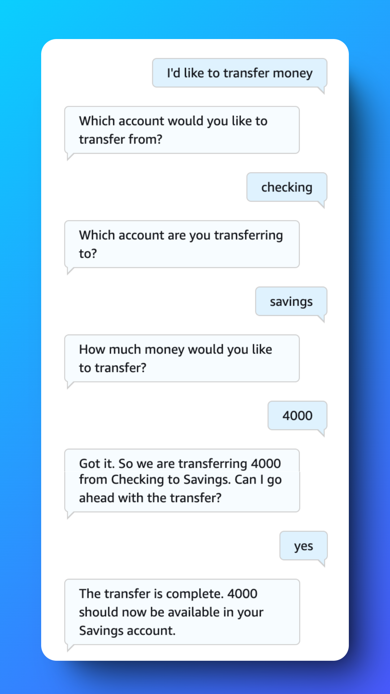
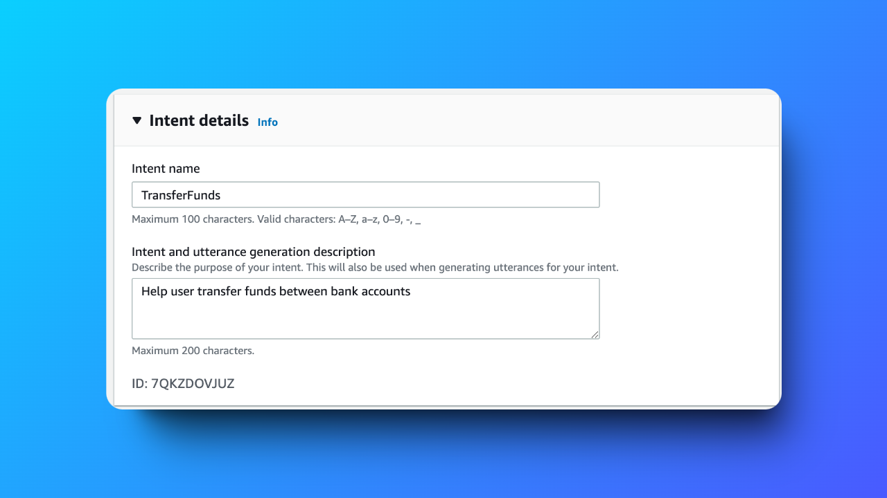
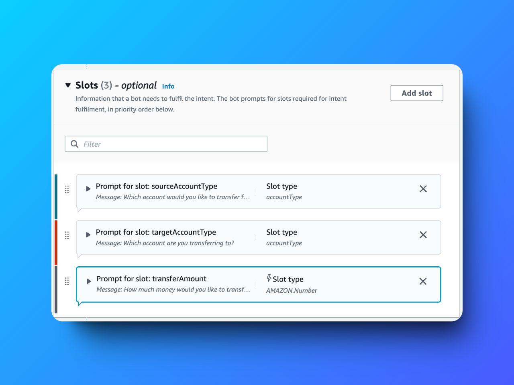
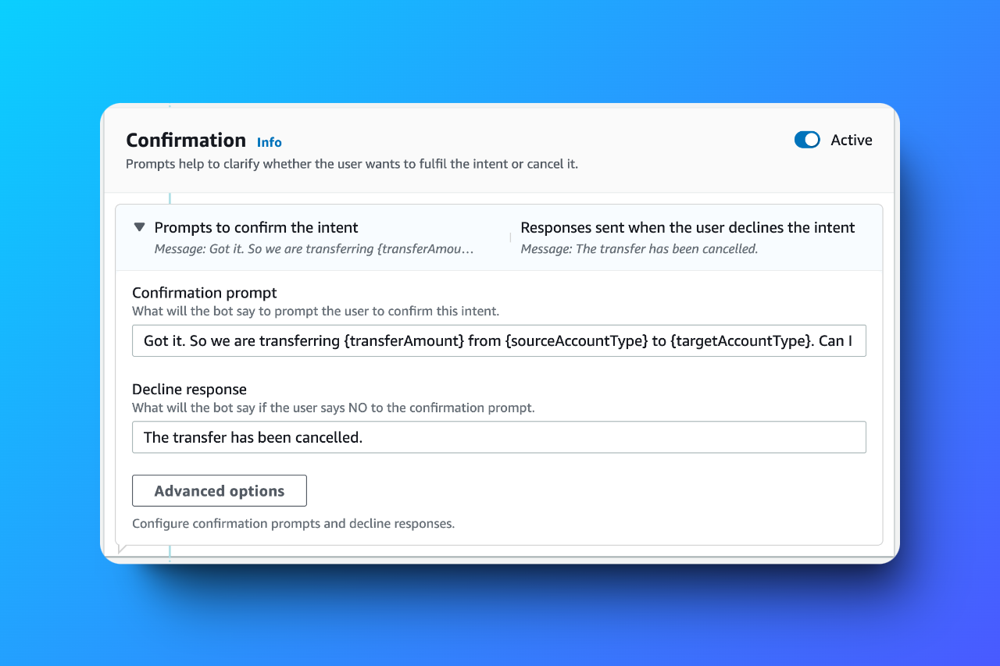

# Building an Amazon Lex Chatbot with Multiple Slots 🤖

---

## 📜 Table of Contents

1. [Project Overview](#project-overview)
2. [Features](#features)
3. [Key Deliverables](#key-deliverables)
4. [Challenges and Lessons Learned](#challenges-and-lessons-learned)
5. [Outcome](#outcome)
6. [Tools and Technologies Used](#tools-and-technologies-used)
7. [Steps to Reproduce](#steps-to-reproduce)
8. [Screenshots](#screenshots)
9. [Acknowledgments](#acknowledgments)
10. [Author](#author)

---

## Project Overview

This project demonstrates the use of **Amazon Lex** to build a chatbot capable of managing multiple slots for seamless user interactions. The chatbot was configured to handle complex intents such as transferring funds between accounts, leveraging **AWS CloudFormation** for automated deployment and resource management.

---

## Features

- **Multi-Slot Management**: Configured multiple slots within intents for detailed user interactions.
- **Natural Language Processing**: Amazon Lex powers the chatbot with advanced NLU capabilities.
- **Confirmation Prompts**: Implemented to ensure user actions are verified before proceeding.
- **CloudFormation Integration**: Simplifies resource deployment and ensures consistency.

---

## Key Deliverables

1. **TransferFunds Intent**:
   - Slots: `sourceAccountType`, `destinationAccountType`, `transferAmount`.
   - Functionality: Enables fund transfers between accounts with user confirmation.

2. **Slot Types**:
   - Configured `accountType` as a reusable slot type for source and destination accounts.

3. **Confirmation Prompts**:
   - Enhanced interaction accuracy by verifying user inputs.

4. **AWS CloudFormation**:
   - Automated the deployment of chatbot resources for seamless management.

---

## Challenges and Lessons Learned

### Challenges
- Configuring multiple slot types for similar functionalities.
- Resolving errors related to missing IAM role permissions during deployment.

### Lessons Learned
- The importance of detailed slot configurations for user intents.
- Using CloudFormation templates significantly reduces deployment errors and manual effort.

---

## Outcome

Successfully created a **multi-slot chatbot** using Amazon Lex that integrates with AWS CloudFormation for automated deployment. This project highlights the efficiency of using Lex for conversational interfaces and CloudFormation for resource management.

---

## Tools and Technologies Used

- **Amazon Lex**: For building the conversational interface.
- **AWS CloudFormation**: To automate resource provisioning.
- **IAM Roles**: Ensured secure access to integrated AWS services.

---

## Steps to Reproduce

1. **Set Up Amazon Lex**:
   - Create a chatbot in Lex with intents and slots.
   - Add confirmation prompts for user actions.

2. **Configure Slots**:
   - Define slot types for accounts and amounts.
   - Use the same slot type for multiple slots in an intent.

3. **Integrate AWS CloudFormation**:
   - Write a CloudFormation template for resources.
   - Deploy the chatbot and resolve any role permission errors.

4. **Test the Chatbot**:
   - Interact with the chatbot to verify intents and slots.
   - Ensure smooth transitions between conversation flows.

---

## Screenshots

### Intent Setup

### Chatbot Slots

### Confirmation Prompt

---

## Acknowledgments

Special thanks to **NextWork.org** for the detailed project guide and community support.

---

## Author

**Hassan Gachoka**  

 

